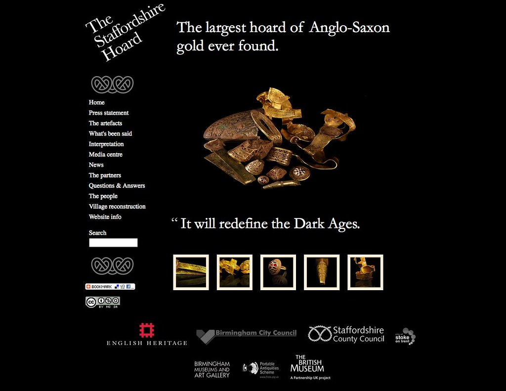
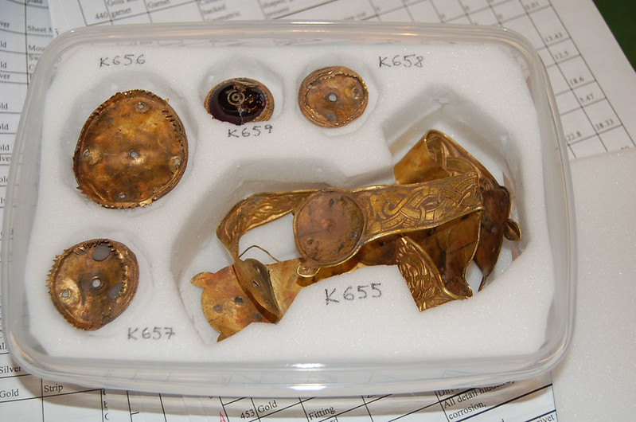

# The Staffordshire Hoard - the original website resurrected



This repository holds a Jekyll port of the original Textpattern site that I built in 2009 with my wife. This was created for the launch news of the discovery of the Staffordshire Hoard, with zero budget and at very short notice for the 24th September 2009.

We made this together in a day, I wrote the code and sorted out the content management system, my wife (Kate Kelland) labelled all the images on Flickr. The original image set had 500k views in the first 5 days, and the website had 175k visitors on the day that news broke of the discovery ([more about this on Academia](https://www.academia.edu/2259655/Meeting_public_interest_in_the_Staffordshire_Hoard)).

I have ported a version from the first month of creation, it later had a few more design elements like the Art Fund logo. The only more up to date section is for news articles, which have been imported up to the last date possible to extract from the Wayback Machine.

## What's missing?

Nothing has been done to change it to meet latest WCAG guidance or to make this mobile device friendly 📲 as this is meant to be a replica
of what I created back then (it's basically replicating the front end, devoid of a backend CMS and now has human readable markdown files).

I have dropped two elements - search and Google Translate.

Flickr image imports via the old api.

## Archived snapshots
You can find the archived versions on the [Wayback machine](https://web.archive.org/web/20230706125313/http://www.staffordshirehoard.org.uk/) and see when it was changed to a wordpress site, run by Staffordshire County Council. The hoard was named best archaeological discovery at the British Archaeology Awards in July 2019.

## Structure 🧱

This is a very simple site, the main site structure uses old versions of:

* JQuery
* Lightbox

This repository is structured as such:

* two folders of markdown files (uses Kramdown for css classes)
  * News stories in _posts
  * Pages in _pages (these are created via collections in config.yml)
* assets - which holds pdfs, videos and screenshots of hoard related things
* images - site images  
* css - contains the original CSS
* js - contains the old CDN hosted jquery etc
* layouts - I only needed one and this is held in _layouts
* reusable html fragments - these are held in _includes, a bit of HTML and liquid

## The old Flickr images :camera:

This port doesn't dynamically pull in the original Flickr images via the API like
the Textpattern site did, basically because many of them are now unavailable,
which could be for a few reasons - the PAS have stopped paying for access to Flickr,
the original images have had their license changed from CC-BY variants or they have
been removed.

When I lead the [Portable Antiquities Scheme](https://finds.org.uk)'s digital projects, I created lots of
images and folders on Flickr.

1. [Staffordshire Hoard Part 1](https://www.flickr.com/photos/finds/albums/72177720307113951) - 5 images only
2. [Staffordshire Hoard Part 2](https://www.flickr.com/photos/finds/albums/72177720307118455) - this contains lots of x-rays
3. [Staffordshire Hoard Part 3](https://www.flickr.com/photos/finds/albums/72177720307132924) - set of original Kevin Leahy images
4. [Staffordshire Hoard Part 4](https://www.flickr.com/photos/finds/albums/72177720307118620) - set of original Kevin Leahy images
5. [Staffordshire Hoard Part 5](https://www.flickr.com/photos/finds/albums/72177720307118620) - set of original Kevin Leahy images
6. [Staffordshire Hoard Part 6](https://www.flickr.com/photos/finds/albums/72177720307118700) - set of original Kevin Leahy images
7. [Staffordshire Hoard Part 7](https://www.flickr.com/photos/finds/albums/72177720307117247) - lots of press and screenshots
8. [Staffordshire Hoard original launch images](https://www.flickr.com/photos/finds/albums/72157622378376316)

You can find some real gems in here, like pictures of the hoard laid out for the Treasure Valuation Committee e.g.



There are also lots of [images on Wikicommons](https://commons.wikimedia.org/w/index.php?search=staffordshire+hoard) of the hoard from various users.

## Records on the PAS database 🗃️

Before I left the Scheme, I had begun to catalogue all the records on the database. They
can be found under the [STAFFS institution](https://finds.org.uk/database/search/results/institution/STAFFS) and are very skeletal, formed from Kevin Leahy's spreadsheet
and the images are the ones from the above sets with raffle ticket identifiers.  

##  Running this locally 🤯

If you want to run a local copy, you need to have Jekyll installed (this was created on 4.2.2).
Then do the following:

```sh
git clone https://github.com/portableant/staffordshire-hoard
cd staffordshire-hoard
bundle install
bundle exec jekyll serve
```
The site is then available at http://localhost:4000

## CNAME 🌐

This repo is set to run off a subdomain pointed at the Github repo, and is configured via the [CNAME](CNAME) file in the root folder of this repo.

## Auto deploy  🚀

An action is set to run and build every time a commit is pushed to the repository.
This uses the simple jekyll action, available via the pages setup section.

## Security and code upgrading 🙈

Dependabot has been enabled.

## License ©️

The code for this project is [licensed as MIT](LICENSE); content is CC-BY-NC-SA as that replicates how this site was
originally released.
